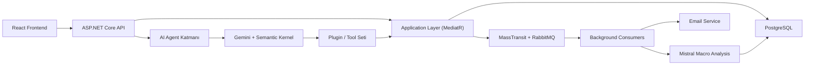
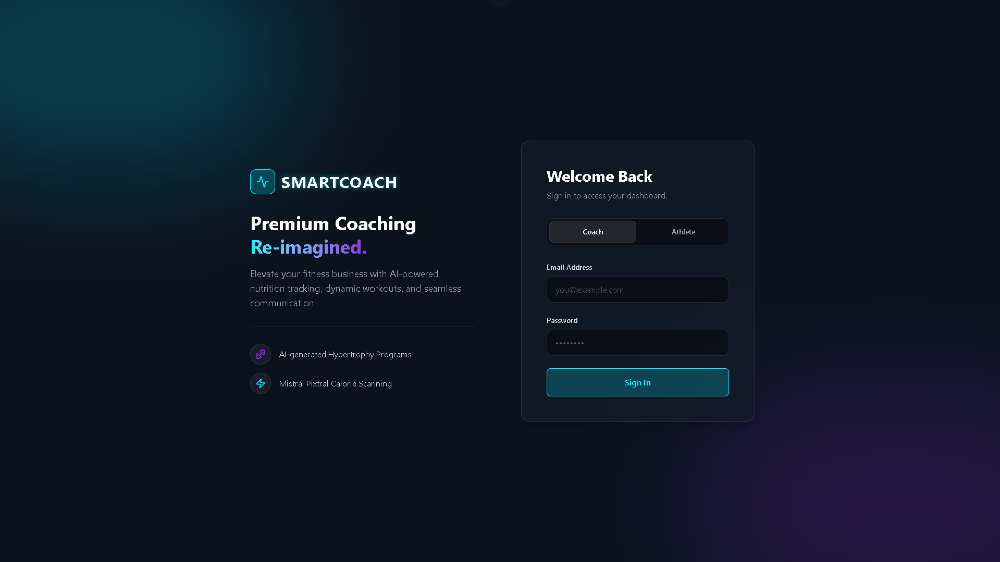
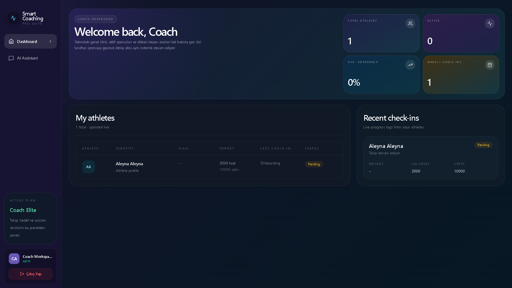
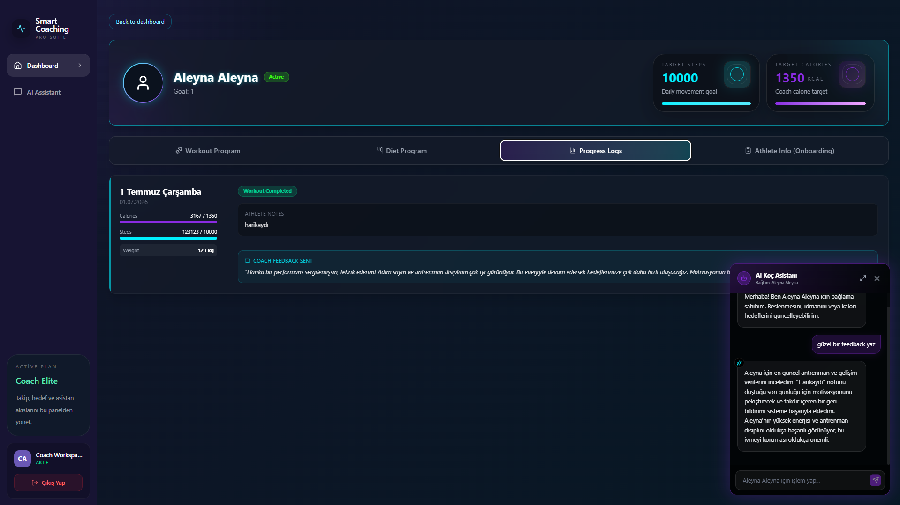
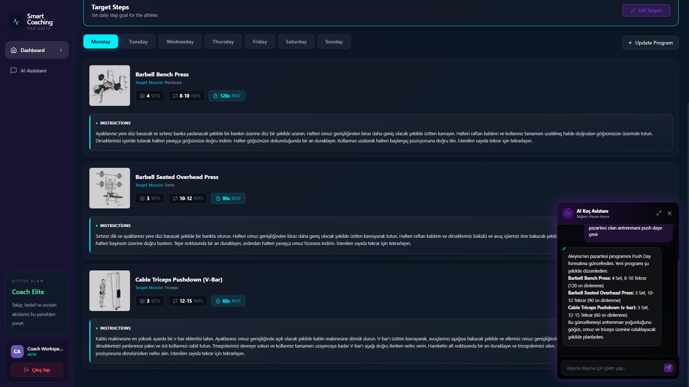
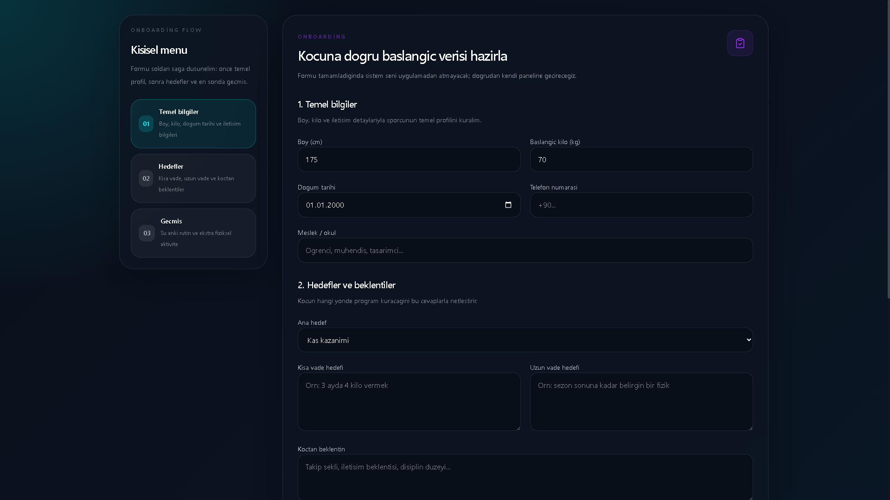
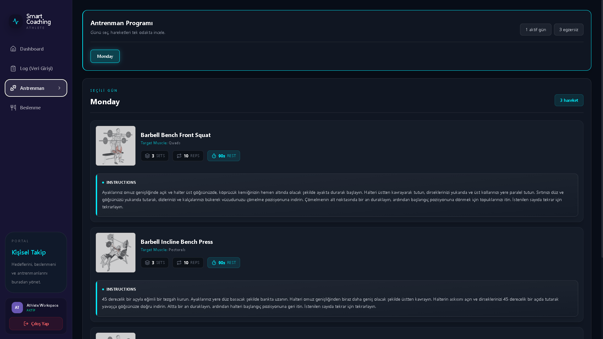
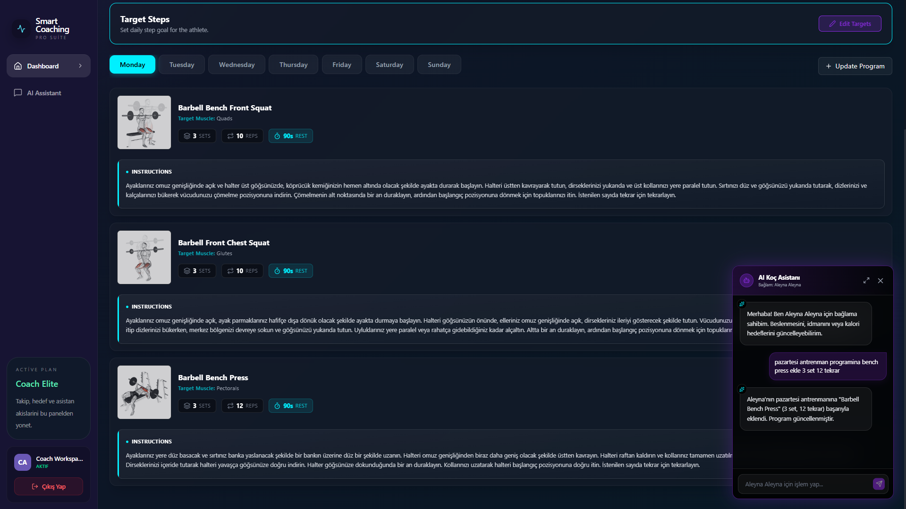

# SmartCoaching

SmartCoaching, koçların sporcularını tek panelden yönetebildiği, sporcuların günlük takiplerini ve onboarding sürecini ayrı bir portalden yürütebildiği, yapay zeka destekli bir koçluk platformudur.

Proje sadece bir dashboard uygulaması değil; aynı zamanda:

- çok kullanıcılı (`multi-tenant`) bir koçluk backend'i
- `Semantic Kernel` tabanlı araç kullanan (`tool-enabled`) bir koç asistanı
- `RabbitMQ + MassTransit` ile çalışan event-driven arka plan akışları
- `Mistral` ile makro hesaplayan beslenme zekası

içeren tam bir ürün akışı kurar.

## Neler Yapabiliyor?

- Koç hesabıyla sporcu oluşturma ve hedef belirleme
- Sporcu onboarding formu toplama
- Antrenman programı oluşturma ve güncelleme
- Beslenme programı oluşturma ve AI ile toplam makro hesaplama
- Günlük kalori, adım, kilo ve not takibi
- Koçun sporcu günlüklerine geri bildirim yazması
- Koç asistanı üzerinden hedef, antrenman ve beslenme güncellemeleri
- Event-driven e-posta ve arka plan makro hesaplama akışları

## Teknoloji Yığını

### Backend

- ASP.NET Core Web API
- PostgreSQL
- Entity Framework Core
- MediatR / Pragmatic CQRS
- MassTransit
- RabbitMQ
- Serilog
- JWT Authentication

### AI Katmanı

- Semantic Kernel
- Google Gemini
- Mistral AI

### Frontend

- React 19
- TypeScript
- Vite
- TanStack Query
- Recharts

## Proje Mimarisi

### Katmanlar

- `SmartCoaching.Api`
  HTTP giriş noktası, middleware, auth ve controller katmanı
- `SmartCoaching.Application`
  command/query handler'lar, DTO'lar, event consumer'lar
- `SmartCoaching.Domain`
  entity'ler ve iş kuralları
- `SmartCoaching.Infrastructure`
  veri erişimi, dış servisler, AI servisleri, plugin'ler, queue yapılandırması
- `SmartCoaching.Web`
  koç ve sporcu deneyimini taşıyan React istemcisi

### Genel Akış



### AI Katmanı Neden Önemli?

Bu projede LLM doğrudan veritabanına yazmaz.

Bunun yerine:

1. Koç mesajı `api/agent/chat` endpoint'ine gelir
2. `GeminiAgentService` mesajın amacını belirler
3. İstek uygun executor'a yönlendirilir
4. Executor, `Semantic Kernel` üzerinden sadece tanımlı plugin/tool'ları kullanır
5. Plugin'ler MediatR command/query hattına bağlanır
6. Domain kuralları ve validation korunarak işlem tamamlanır

Bu sayede AI katmanı:

- faydalı olur
- kontrolsüz davranmaz
- tenant sınırlarını bozmaz
- mevcut backend mantığını delmez

Detaylı teknik mimari ve tüm akış şemaları için:

- [Mimari Dokümanı](./docs/ARCHITECTURE.md)
- [API Dokümantasyonu](./API_DOCUMENTATION.md)

## Ekran Görüntüleri

### 1. Giriş Deneyimi

Koç ve sporcu için tek giriş alanı, ürünün yapay zeka destekli yönünü daha ilk ekranda anlatır.



### 2. Koç Paneli

Koç panelinde sporcu listesi, aktif durumlar ve son check-in akışı tek yerden yönetilir.



### 3. AI Destekli Koç Akışı

Koç, sporcu bağlamı içindeyken AI asistana doğal dilde komut verebilir; sistem bunu kontrollü tool akışına çevirir.



### 4. AI ile Program Güncelleme

Koç asistanı, program üzerinde kontrollü güncelleme yapabilir ve sonucu aynı akışta gösterir.



### 5. Sporcu Onboarding

Sporcu ilk girişte onboarding formunu doldurur. Bu form koçun hedef, program ve plan kararlarını besler.



### 6. Sporcu Portalı

Sporcu tarafında antrenmanlar gün bazlı, hareket detayları ve açıklamalarla birlikte gösterilir.



### 7. Koçun Gördüğü Onboarding Özeti

Koç, onboarding sonrası sporcunun başlangıç verisini ayrı sekmeden detaylı olarak inceler.



## Semantic Kernel ve Tool Yapısı

Projede `Semantic Kernel`, LLM ile backend arasında bir orkestrasyon katmanı olarak kullanılır.

Koç asistanına verilen başlıca yetenekler:

- sporcu listesini getirme
- sporcu profili ve son loglarını okuma
- hedef kalori ve adım güncelleme
- diet programı okuma / güncelleme
- workout programı okuma / güncelleme
- gelişim günlüğüne koç geri bildirimi yazma

Bu yaklaşımın avantajı:

- LLM doğrudan persistence katmanına gitmez
- tüm işlemler command/query hattından geçer
- business logic application/domain katmanında kalır
- sistem daha güvenli ve genişletilebilir olur

## Queue ve Arka Plan İşleri

`RabbitMQ + MassTransit` ile aşağıdaki işler asenkron olarak yürütülür:

- yeni sporcu oluşturulunca hoş geldin maili
- onboarding tamamlanınca koça bildirim
- diet programı değişince toplam makro analizi

Bu sayede kullanıcı butona bastığında ana işlem hızlı döner, ağır işler arka planda tamamlanır.

## Multi-Tenant Yapı

Sistem koç bazlı veri izolasyonu ile çalışır.

Yani:

- her koç sadece kendi sporcularını görür
- agent çağrıları aktif `coachId` bağlamı ile çalışır
- AI tool'ları da aynı tenant sınırlarına uyar

Bu, özellikle AI katmanında kritik bir güvenlik kararıdır.

## Lokal Kurulum

### 1. Altyapı servislerini aç

Repo kökünde:

```bash
docker compose up -d
```

Bu komut aşağıdaki servisleri açar:

- PostgreSQL (`5434`)
- RabbitMQ (`5672`, `15672`)
- Redis (`6379`)

### 2. Backend'i çalıştır

`SmartCoaching.Api` projesini çalıştır.

Gerekli yapılandırmalar:

- PostgreSQL connection string
- Gemini API key
- Mistral API key
- SMTP ayarları

### 3. Frontend'i çalıştır

`SmartCoaching.Web` klasöründe:

```bash
npm install
npm run dev
```

## Geliştirme Notları

- Backend tarafı pragmatik CQRS ile ilerler
- Frontend tarafı feature-based klasör yapısıyla ayrıştırılmıştır
- Ortak servisler `shared/services` altında tutulur
- AI operasyonları plugin bazlı ve kontrol edilen yetenek seti ile yönetilir

## Özet

Bu proje bir RAG sistemi değildir.

Bu proje, `Semantic Kernel` tabanlı, `tool-enabled`, `multi-tenant`, `event-driven` bir AI destekli koçluk platformudur.

Odak noktası sadece LLM entegrasyonu değil; LLM'i gerçek backend akışlarına güvenli ve ölçeklenebilir şekilde yerleştirmektir.
