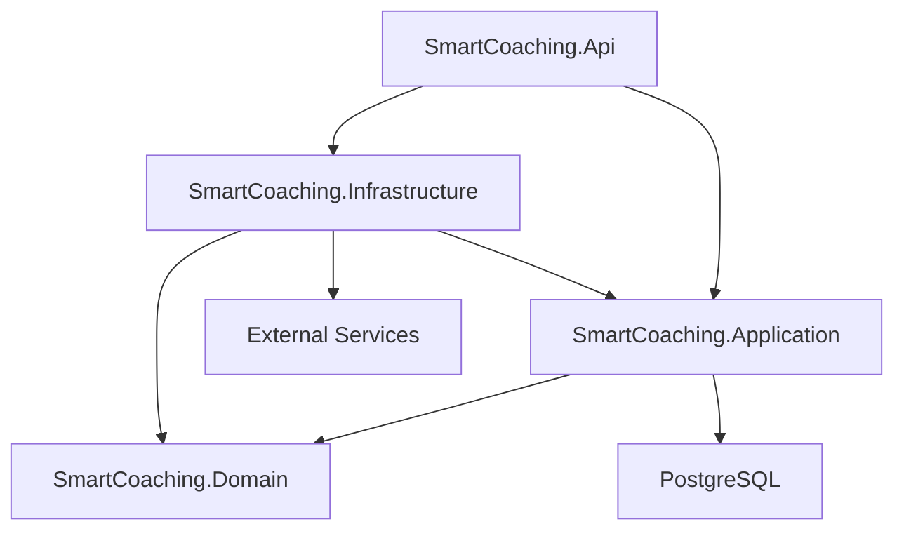
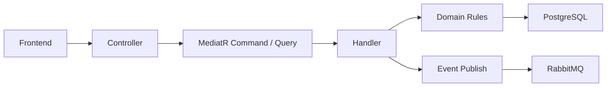
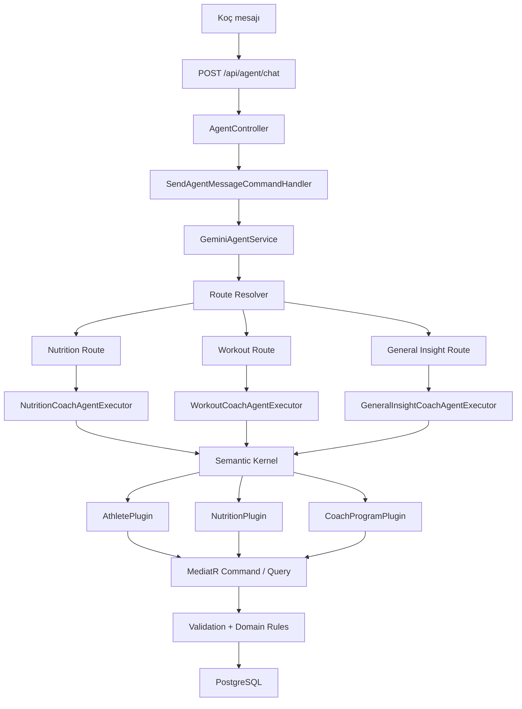
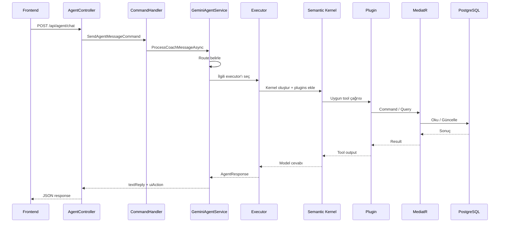
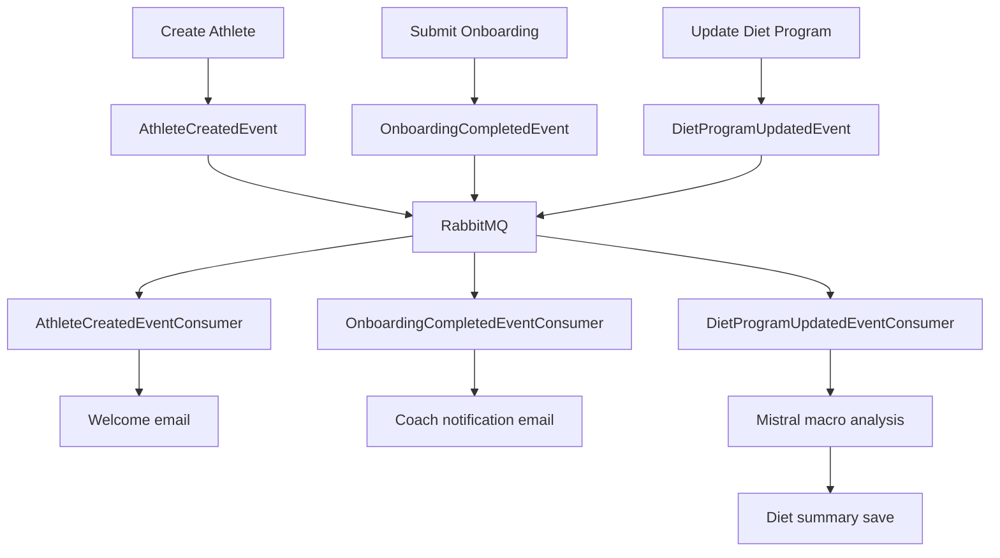

# SmartCoaching Mimari Dokümanı

Bu belge, SmartCoaching'in arka plan işleyişini; endpoint akışlarını, `Semantic Kernel` kullanan AI katmanını ve `RabbitMQ` tabanlı kuyruk yapısını ayrıntılı biçimde anlatır.

## 1. Katmanlı Yapı

### Sorumluluklar

- `Api`
  endpoint'ler, auth, middleware, startup
- `Application`
  command/query handler'lar, consumer'lar, iş akışı koordinasyonu
- `Domain`
  entity'ler ve domain kuralları
- `Infrastructure`
  EF Core, AI servisleri, queue, email, harici servisler

## 2. Endpoint Grupları

### Auth

- `POST /auth/login`
- `POST /auth/athlete-login`
- `PUT /auth/change-password`

### Coach / Athlete Yönetimi

- `POST /athletes`
- `GET /athletes`
- `GET /athletes/{id}`
- `PUT /athletes/{id}/targets`
- `POST /athletes/{id}/progress`
- `GET /athletes/{id}/progress`
- `POST /athletes/{id}/onboarding`
- `POST /athletes/{id}/workout-programs`
- `GET /athletes/{id}/workout-programs`
- `POST /athletes/{id}/diet-programs`
- `GET /athletes/{id}/diet-programs`

### Dashboard

- `GET /coaches/dashboard`

### AI Asistan

- `POST /api/agent/chat`

## 3. Genel Backend Akışı

## 4. AI Katmanı

### Temel Fikir

Koç asistanı doğrudan veritabanına yazmaz.  
LLM sadece tanımlı plugin/tool'ları kullanabilir.

Bu yapı üç katmana ayrılır:

1. yönlendirme (`route`)
2. executor
3. plugin/tool

## 5. Semantic Kernel Akışı

## 6. Route Mantığı

`GeminiAgentService`, gelen mesajı ilk aşamada niyete göre üçe ayırır:

- `Nutrition`
  kalori, adım, makro, diet, öğün, kilo alma/verme
- `Workout`
  antrenman, egzersiz, set, tekrar, dinlenme, program değişikliği
- `GeneralInsight`
  özetleme, yorumlama, trend çıkarma, genel içgörü

## 7. Executor Mantığı

Her executor kendi alanı için farklı system prompt ve farklı plugin setiyle çalışır.

### Nutrition Executor

- AthletePlugin
- NutritionPlugin
- CoachProgramPlugin

### Workout Executor

- AthletePlugin
- CoachProgramPlugin

### General Insight Executor

- AthletePlugin
- NutritionPlugin
- CoachProgramPlugin

## 8. Plugin'ler Ne Yapar?

### AthletePlugin

- `GetAthletes`
- `GetAthleteProfile`
- `GetAthleteProgress`
- `AddCoachFeedback`
- `GetAthleteConsumedFoods`

### NutritionPlugin

- `UpdateTargetCalories`
- `UpdateTargetSteps`
- `UpdateTargets`

### CoachProgramPlugin

- `GetDietProgram`
- `UpdateDietProgram`
- `GetWorkoutProgram`
- `UpdateWorkoutProgram`
- `SearchExercises`

## 9. Neden Plugin Yapısı Kullanıldı?

Bu sayede:

- LLM doğrudan DB erişimi almaz
- her aksiyon kontrollü araçlarla sınırlandırılır
- validation ve authorization korunur
- business logic dağılmaz
- yeni tool eklemek kolaylaşır

Kısacası AI, serbest çalışan bir yazıcı değil; backend kurallarına bağlı bir operatör gibi davranır.

## 10. AI İstek Sırası

## 11. Mistral Nerede Devrede?

Gemini koç asistanı ve tool orchestration tarafında kullanılır.  
Mistral ise özellikle beslenme programındaki öğünleri analiz edip toplam makroları tahmin etmek için kullanılır.

Yani:

- `Gemini` = koç asistanı
- `Mistral` = nutrition analysis

## 12. Queue Yapısı

Sistem arka plan işlemlerini `MassTransit + RabbitMQ` ile taşır.

### Kullanılan consumer'lar

- `AthleteCreatedEventConsumer`
- `OnboardingCompletedEventConsumer`
- `DietProgramUpdatedEventConsumer`

## 13. Queue Akışı

## 14. Neden Queue Kullanıldı?

Bu sayede:

- kullanıcı isteği hızlı döner
- mail gönderimi request'i bloklamaz
- diet macro analizi arka planda çalışır
- sistem event-driven hale gelir

## 15. Multi-Tenant Yapı

Bu sistem koç bazlı tenant ayrımı ile çalışır.

Yani:

- her koç sadece kendi sporcularını görür
- AI plugin sorguları aktif `coachId` ile sınırlandırılır
- tool çağrıları tenant-aware şekilde davranır

Bu özellikle AI katmanında kritiktir; model yanlış sporcuya işlem yapmamalıdır.

## 16. Başlangıç ve Seed Akışı

Uygulama açıldığında:

- servis kayıtları yapılır
- DB context ayağa kalkar
- eksik `MustChangePassword` kolonu manuel olarak kontrol edilir
- egzersiz seed işlemi çalışır

Bu akış `Program.cs` içinde yürür.

## 17. Docker Servisleri

`docker-compose.yml` ile şu servisler ayağa kaldırılır:

- PostgreSQL
- Redis
- RabbitMQ

Redis şu an altyapıda hazırdır; RabbitMQ ve PostgreSQL aktif iş akışında doğrudan rol alır.

## 18. Sonuç

SmartCoaching'in AI tarafı bir RAG sistemi değildir.

Bu yapı daha doğru biçimde şöyle tanımlanır:

- `tool-enabled LLM backend`
- `Semantic Kernel orchestration`
- `multi-tenant AI-assisted coaching platform`
- `event-driven backend architecture`

Buradaki asıl değer, LLM'i sisteme eklemekten çok; onu güvenli, kontrollü, tenant-aware ve genişletilebilir bir backend mimarisi içine yerleştirmektir.
